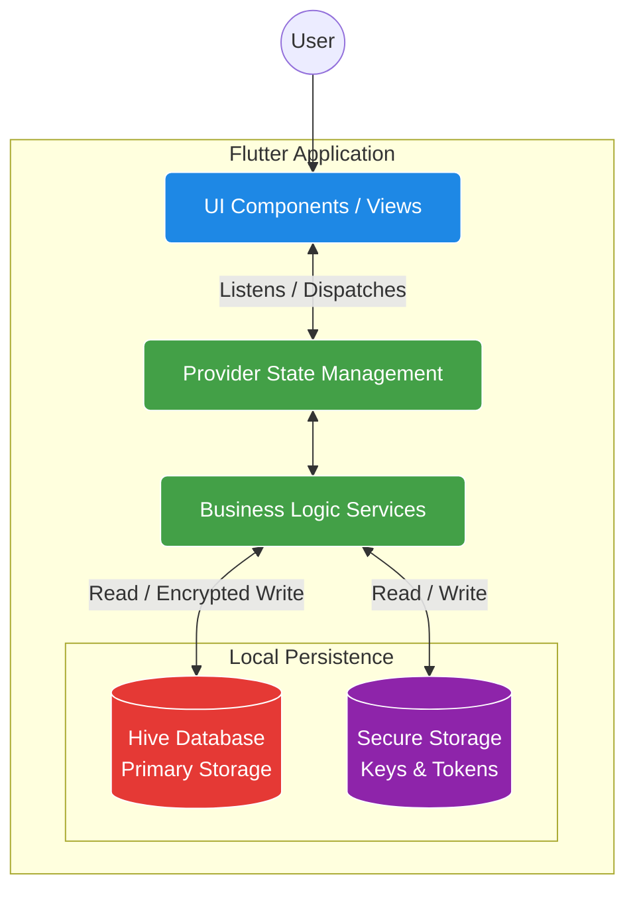
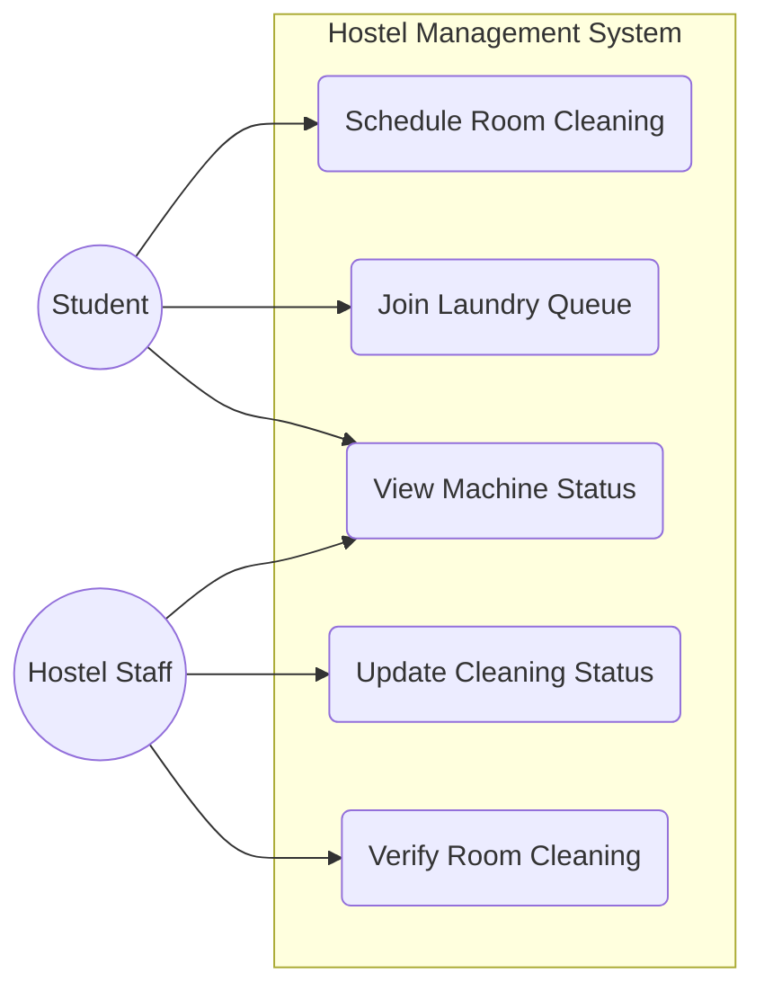
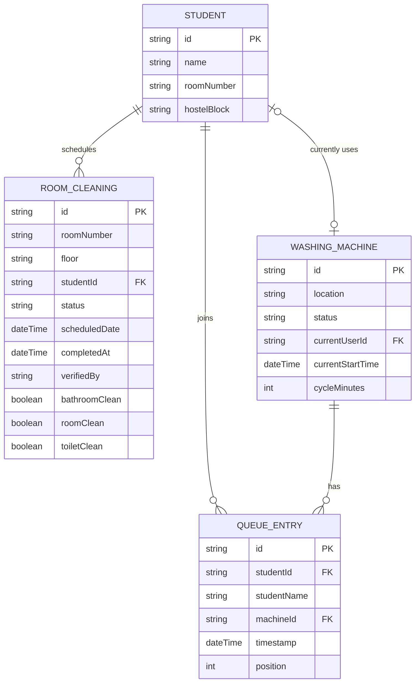
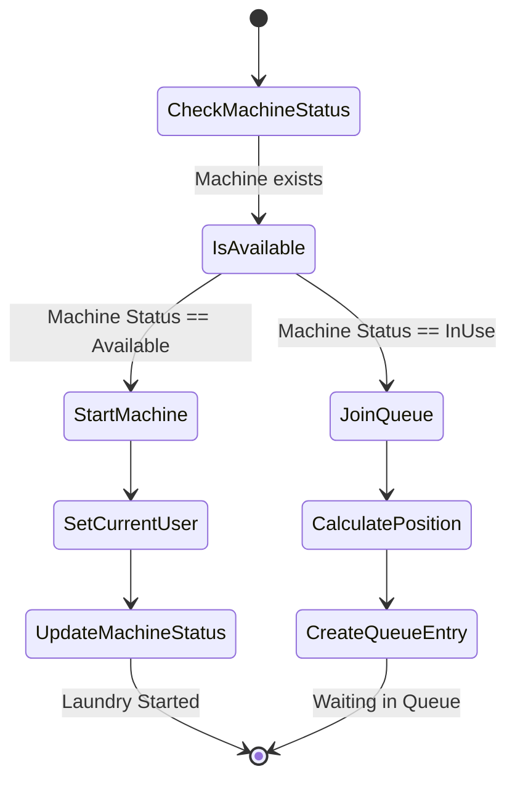
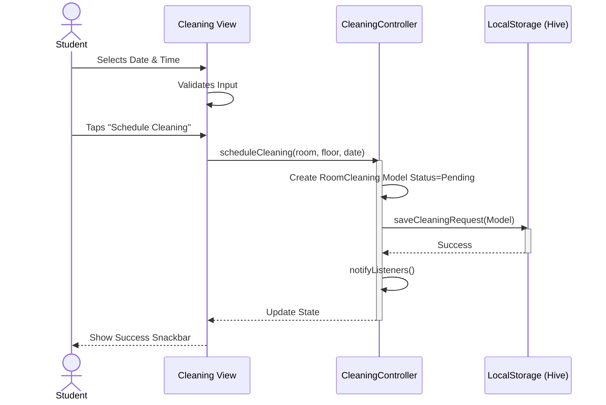

# Project Diagrams

This document contains structural and behavioral diagrams for the Hostel Management System based on its models and architecture.

## 1. System Architecture Diagram
*Illustrates the offline-first Flutter application structure.*



## 2. Use Case Diagram
*Shows the interactions between the Student/Staff and the system.*

```mermaid
usecase
    %% Mermaid usecase using graph (Actor to Use Case)
    %% Note: Standard flowchart used to mimic Use Case Diagram
```

Wait, `usecase` isn't standard in Mermaid, let me use `flowchart` to simulate standard UML Use Case or use Mermaid's requirement diagram? No, Mermaid doesn't strictly have a standard structural "Use Case" diagram syntax that renders perfectly everywhere except by using `flowchart` with stick figures or rectangles. Wait, `journey` or `mindmap`? Flowchart is best.



## 3. Entity Relationship (ER) Diagram
*Visualizes the core un-coupled data models stored in Hive.*



## 4. Activity Diagram
*Shows the workflow of joining a laundry queue.*



## 5. Sequence Diagram
*Details the process of scheduling a room cleaning.*


